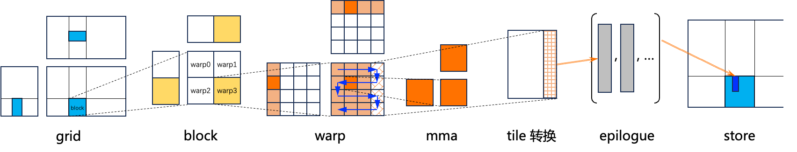

# ACTLIZE 1.0.0 for PPU

_ACTLIZE 1.0.0 - PPU Adaptation (July 2026)_

ACTLIZE 1.0.0 for PPU is a specialized adaptation of [CUTLASS 3.6.0](https://github.com/NVIDIA/cutlass),
originally developed by NVIDIA, re-engineered for PPU architectures.


**Key Adaptations:**
- Full support for ppu001 and ppu0015 architectures
- PPU-specific tensor op mma operators, as well as data movement operators such as aiu ld and tsm ld swizzle (include/cute)
- PPU-optimized collective builder and epilogue APIs for kernels (include/cutlass)


## PPU-Specific Features

### What's New in ACTLIZE 1.0.0 for PPU

**PPU-Specific Features:**

- **PPU001(810e, ..) and PPU0015(M890, ..) Support:** Full GEMM support across both architectures
  - PPU001: FP16, BF16, TF32, INT8 tensor operations
  - PPU0015: Newly supported FP8, FP4 tensor operations with EVT support

- **PPU-Specific Kernels:**
  - Tensor operation GEMM with 16x16 instruction shapes
  - INT8 quantized inference kernels
  - Mixed precision GEMM (fp16/bf16 x int8/int4)
  - FP8 GEMM with epilogue fusion (ppu0015)
  - FP4 GEMM with blockwise quantization (ppu0015)

- **PPU Examples:**
  - [Basic Tensor Operation GEMM](./examples/08_ppu_basic_tensor_op_gemm)
  - [Collective Builder GEMM](./examples/09_ppu_gemm_with_collective_builder)
  - [Pointer-Array Batched GEMM](./examples/10_ppu_ptr_array_batched_gemm)
  - [Grouped GEMM](./examples/11_ppu_grouped_gemm)
  - [Mixed Precision GEMM](./examples/16_ppu_mixed_dtype_gemm)
  - [FP8 GEMM](./examples/100_ppu0015_fp8_gemm)
  - [FP4 GEMM](./examples/101_ppu0015_fp4_gemm)
  - [GEMM with EVT](./examples/102_ppu0015_gemm_evt)
  - And more...

### PPU Architecture Support

| Feature | PPU001 | PPU0015 |
|---------|---------|---------|
| Architecture Tag | `cutlass::arch::PPU0010` | `cutlass::arch::PPU0015` |
| Required Toolchain | PPU SDK | PPU SDK |
| Alu Core Ops | Yes | Yes |
| Tensor Cell Ops | Yes | Yes (Enhanced) |
| FP16 GEMM | Full | Full |
| BF16 GEMM | Full | Full |
| TF32 GEMM | Full | Full |
| INT8 GEMM | Full | Full |
| FP8 GEMM | No | Full |
| FP4 GEMM | No | Full |
| Grouped GEMM | Full | Full |
| Batched GEMM | Full | Full |
| EVT Support | Full | Full |


## Getting Started

### Prerequisites

- **PPU Hardware:** ZW 610 / 610E / 810 / 810E / M890
- **PPU SDK** (provides `hgcc` device compiler under `${PPU_SDK}/bin/hgcc`)
- **CMake:** 3.19+
- **Host Compiler:** C++17 capable (GCC 9.4+)

<!-- TODO: update PPU website later -->
For PPU SDK installation, driver setup, and compiler usage, please refer to the
[PPU Developer Portal](https://developer.t-head.cn/docs_center/doc_list/index.html3).

### Quick Build
See the [Quick Start Guide](./media/docs/quickstart.md) to get started quickly.

## Documentation

ACTLIZE is described in the following documents.

- [Quick Start Guide](./media/docs/quickstart.md) - build and run ACTLIZE
- [Functionality](./media/docs/functionality.md) - summarizes functionality available in ACTLIZE
- [Code Organization](./media/docs/code_organization.md) - describes the organization and contents of the ACTLIZE project
- [ACTLIZE Profiler](./media/docs/profiler.md) - command-line driven profiling application

## PPU-Specific API Reference

### PPU Include Header

All PPU components are accessible via the main PPU header:

```cpp
#include <ppu_include.hpp>
```

This includes:
- PPU CuTe layouts and atoms
- PPU collective builders
- PPU kernel implementations

### PPU Architecture Tags

```cpp
// ppu001
using ArchTag = cutlass::arch::PPU0010;

// ppu0015
using ArchTag = cutlass::arch::PPU0015;
```


## Project Structure

ACTLIZE is arranged as a header-only library along with Utilities, Tools, Examples, and unit tests.

A detailed explanation of the source code organization may be found in the
[ACTLIZE documentation](./media/docs/code_organization.md), but several main components are summarized below.

### ACTLIZE Template Library

```
include/                     # client applications should target this directory in their build's include paths

  cutlass/                   # Device-side templates for Linear Algebra Subroutines (PPU) - headers only

    arch/                    # direct exposure of architecture features (including instruction-level GEMMs)
      *
    gemm/                    # code specialized for general matrix product computations
      collective/            # collective operators
      kernel/                # device kernel entry points
      device/                # device-level GEMM API
      *

    epilogue/                # code specialized for epilogue implmentations
      collective/            # collective operators
      fusion/                # epilogue fusion ops
      *

    layout/                  # layout definitions for matrices, tensors, and other mathematical objects in memory

    platform/                # device-capable Standard Library components

    reduction/               # bandwidth-limited reduction kernels that do not fit the "gemm" model

    thread/                  # simt code that can be performed within a device thread

    transform/               # code specialized for layout, type, and domain transformations

    *                        # core vocabulary types, containers, and basic numeric operations

  cute/                      # CuTe Layout, layout algebra, MMA/Copy atoms, tiled MMA/Copy

    algorithm/               # Definitions of core operations such as copy, gemm, and operations on cute::tuples

    arch/                    # Bare bones PTX wrapper structs for copy and math instructions

    atom/                    # Meta-information either link to or built from arch/ operators

      mma*.hpp               # cute::Mma_Atom and cute::TiledMma

      copy*.hpp              # cute::Copy_Atom and cute::TiledCopy

    *                        # Core library types such as Shape, Stride, Layout, Tensor, and associated operations
```

### PPU-Specific Examples

[ACTLIZE examples](./examples) apply ACTLIZE templates to implement basic computations.

### Tools

```
tools/
  library/                   # ACTLIZE Instance Library - contains instantiations of all supported ACTLIZE templates
    include/
      cutlass/
        library/

  profiler/                  # Profiler                 - command-line utility for executing operations in the
                             #                            ACTLIZE Library

  util/                      # ACTLIZE Utilities        - contains numerous helper classes for
    include/                 #                            manging tensors in device memory, reference
      cutlass/               #                            implementations for GEMM, random initialization
        util/                #                            of tensors, and I/O.
```

### Test

The `test/unit/` directory consist of unit tests implemented with Google Test that demonstrate
basic usage of Core API components and complete tests of the ACTLIZE GEMM computations.

## Performance Profiling

The `tools/profiler/` directory contains a command-line utility for launching each of the GEMM kernels.
It can be built as follows:

```bash
$ make cutlass_profiler -j16
```

### Building all GEMM kernels (_long_ build times)

By default, only one tile size is instantiated for each data type, math instruction, and layout.
To instantiate all, set the following environment variable when running CMake from an empty `build/` directory.
Beware, this results in *tens of thousands* of kernels and long build times.
This would also result in a large binary size and on some platforms linker to fail on building the library.
Therefore, it's highly recommended to generate only a subset of kernels as demonstrated in the sub-section below.
```bash
$ cmake .. -DCUTLASS_PPU_ARCHS=ppu0010 -DCUTLASS_LIBRARY_KERNELS=all
...
$ make cutlass_profiler -j16
```

### Building a subset of GEMM kernels (_reduced_ build times)

To compile strictly one kernel or a small set of kernels, a comma-delimited list of kernel names with
wildcard characters may be used to reduce the set of kernels. The following examples show building exactly one
or a subset of kernels for PPU architecture:

### Building a subset Tensor Cell GEMM kernels

To compile a subset of Tensor Cell GEMM kernels with FP32 accumulation and FP16 input targeting PPU,
use the below cmake command line:
```bash
$ cmake .. -DCUTLASS_PPU_ARCHS=ppu0010 -DCUTLASS_LIBRARY_KERNELS=cutlass*_tensorop_s*gemm_f16*_nt*_align8*
...
$ make cutlass_profiler -j16
```

Example command line for profiling a subset of Tensor Cell GEMM kernels is as follows:
```bash
./tools/profiler/cutlass_profiler --kernels=cutlass*_tensorop_s*gemm_f16*_nt*_align8* --m=3456 --n=4096 --k=4096

...
=============================
  Problem ID: 1

        Provider: CUTLASS
   OperationKind: gemm
       Operation: cutlass3x_ppu0015_tensorop_s16x16x16gemm_f16_f16_f32_f16_f16_256x256x64_4_ntn_align8_aiu_multistage_overlap_prologue_epi_nosmem

          Status: Success
    Verification: ON
     Disposition: Passed

reference_device: Passed
          acBLAS: Not run
           acDNN: Not run

       Arguments: --gemm_kind=universal --m=3456 --n=4096 --k=4096 --A=f16:column --B=f16:row --C=f16:row --D=f16:row  \
                  --alpha=1 --beta=0 --split_k_mode=serial --split_k_slices=1 --batch_count=1 --raster_order=heuristic  \
                  --swizzle_size=1 --op_class=tensorop --accum=f32 --cta_m=256 --cta_n=256 --cta_k=64 --cluster_m=1 --cluster_n=1  \
                  --cluster_k=1 --stages=4 --warps_m=4 --warps_n=4 --warps_k=1 --inst_m=16 --inst_n=16 --inst_k=16 --min_cc=80  \
                  --max_cc=1024

           Bytes: 90177536  bytes
           FLOPs: 115992428544  flops
           FLOPs/Byte: 1286

         Runtime: 0.356775  ms
          Memory: 235.399 GiB/s

            Math: 325113 GFLOP/s


```

## More Details on Compiling Kernels and Profiler
- Please follow the links for more CMake examples on selectively compiling kernels:
  - [GEMM CMake Examples](./media/docs/quickstart.md#gemm-cmake-examples)
- [Further details about the Profiler are described here.](./media/docs/profiler.md)


## Copyright

Copyright (c) 2022-2026, T-HEAD (SHANGHAI) SEMICONDUCTOR CO., LTD. All rights reserved.

Copyright (c) 2017 - 2024 NVIDIA CORPORATION & AFFILIATES. All rights reserved.
SPDX-License-Identifier: BSD-3-Clause

```
Redistribution and use in source and binary forms, with or without
modification, are permitted provided that the following conditions are met:

1. Redistributions of source code must retain the above copyright notice, this
list of conditions and the following disclaimer.

2. Redistributions in binary form must reproduce the above copyright notice,
this list of conditions and the following disclaimer in the documentation
and/or other materials provided with the distribution.

3. Neither the name of the copyright holder nor the names of its
contributors may be used to endorse or promote products derived from
this software without specific prior written permission.

THIS SOFTWARE IS PROVIDED BY THE COPYRIGHT HOLDERS AND CONTRIBUTORS "AS IS"
AND ANY EXPRESS OR IMPLIED WARRANTIES, INCLUDING, BUT NOT LIMITED TO, THE
IMPLIED WARRANTIES OF MERCHANTABILITY AND FITNESS FOR A PARTICULAR PURPOSE ARE
DISCLAIMED. IN NO EVENT SHALL THE COPYRIGHT HOLDER OR CONTRIBUTORS BE LIABLE
FOR ANY DIRECT, INDIRECT, INCIDENTAL, SPECIAL, EXEMPLARY, OR CONSEQUENTIAL
DAMAGES (INCLUDING, BUT NOT LIMITED TO, PROCUREMENT OF SUBSTITUTE GOODS OR
SERVICES; LOSS OF USE, DATA, OR PROFITS; OR BUSINESS INTERRUPTION) HOWEVER
CAUSED AND ON ANY THEORY OF LIABILITY, WHETHER IN CONTRACT, STRICT LIABILITY,
OR TORT (INCLUDING NEGLIGENCE OR OTHERWISE) ARISING IN ANY WAY OUT OF THE USE
OF THIS SOFTWARE, EVEN IF ADVISED OF THE POSSIBILITY OF SUCH DAMAGE.
```

Copyright (c) 2017-2025 Advanced Micro Devices, Inc. All rights reserved.
SPDX-License-Identifier: MIT

```
Permission is hereby granted, free of charge, to any person obtaining a copy
of this software and associated documentation files (the "Software"), to deal
in the Software without restriction, including without limitation the rights
to use, copy, modify, merge, publish, distribute, sublicense, and/or sell
copies of the Software, and to permit persons to whom the Software is
furnished to do so, subject to the following conditions:

The above copyright notice and this permission notice shall be included in all
copies or substantial portions of the Software.

THE SOFTWARE IS PROVIDED "AS IS", WITHOUT WARRANTY OF ANY KIND, EXPRESS OR
IMPLIED, INCLUDING BUT NOT LIMITED TO THE WARRANTIES OF MERCHANTABILITY,
FITNESS FOR A PARTICULAR PURPOSE AND NONINFRINGEMENT. IN NO EVENT SHALL THE
AUTHORS OR COPYRIGHT HOLDERS BE LIABLE FOR ANY CLAIM, DAMAGES OR OTHER
LIABILITY, WHETHER IN AN ACTION OF CONTRACT, TORT OR OTHERWISE, ARISING FROM,
OUT OF OR IN CONNECTION WITH THE SOFTWARE OR THE USE OR OTHER DEALINGS IN THE
SOFTWARE.
```